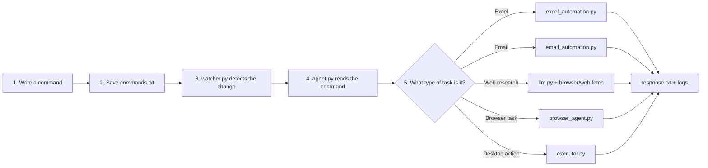

# AI Desktop Automation Agent

AI Desktop Automation Agent is a Windows-first command runner that watches `commands.txt`, interprets the request, and routes it to the right automation path for Excel, email, web research, or browser actions.

## What it does

- Watches `commands.txt` for changes
- Executes desktop, browser, Excel, and email tasks
- Uses LLM planning for flexible commands
- Writes results to `response.txt`
- Logs activity to `agent.log`, `agent_detailed.log`, and memory files

## Main features

- **Desktop automation** with mouse, keyboard, window focus, OCR, and app launching
- **Excel automation** for parsing and executing structured spreadsheet actions
- **Email automation** for composing, drafting, scheduling, and sending mail
- **Web research** for collecting and summarizing information from the web
- **Agentic browser mode** for step-by-step browser tasks with Playwright

## Architecture



In short: **you write a command, save it, and the agent routes it to the right module.**

## Requirements

- Windows
- Python 3.10+
- Google Chrome installed (recommended)
- Tesseract OCR installed at:
  `C:\Program Files\Tesseract-OCR\tesseract.exe`
- Optional:
  - Gmail API credentials for API-based email sending
  - Playwright browsers for agentic browser mode

## Installation

```bash
git clone https://github.com/YOUR_USERNAME/AI-Deskstop-Automation-Agent.git
cd AI-Deskstop-Automation-Agent
python -m venv .venv
.venv\Scripts\activate
pip install -r requirements.txt
```

If you use Playwright:

```bash
playwright install
```

## Configuration

Create a `.env` file in the project root if needed:

```env
OPENAI_API_KEY=your_key
NVIDIA_API_KEY=your_key
OPENROUTER_API_KEY=your_key
LLM_PROVIDER=auto
AGENT_MODEL=your-model-name

AGENT_EMAIL_MODE=api
AGENT_EXCEL_MODE=hybrid

GMAIL_API_CREDENTIALS=gmail_credentials.json
GMAIL_API_TOKEN=gmail_token.json
```

## Running the agent

```bash
python agent.py
```

Then:

1. Open `commands.txt`
2. Type a command
3. Save the file
4. Check `response.txt` for the result

Stop the agent with `Ctrl+C` in the terminal. PyAutoGUI failsafe is also enabled: move the mouse to the top-left corner to stop automation.

## Example commands

### Excel

```text
open C:\Users\DELL\Downloads\Orders_Table (2).csv and delete 6 rows
```

```text
find sum of column Sales in workbook Budget
```

### Email

```text
compose a mail to someone@example.com subject "Project update" body "Please review the attached file" and send it
```

```text
schedule email to someone@example.com subject "Reminder" body "Follow up tomorrow" in 10 minutes
```

### Web research

```text
fetch information on titanium price and density
```

```text
open google and fetch information about 0603YG105ZAT2A, its voltage, temperature coefficient, operating temperature
```

### Agentic browser

```text
browse: log in to the site and download the latest report
```

## Tests

```bash
python -m unittest discover
```

## Project files

- `agent.py` - main entry point and command router
- `watcher.py` - monitors `commands.txt`
- `executor.py` - desktop action executor
- `excel_automation.py` - spreadsheet parsing and execution
- `email_automation.py` - email command parsing and build logic
- `browser_agent.py` - Playwright-based browsing loop
- `llm.py` - model calls, planning, and usage tracking

## License

MIT license
